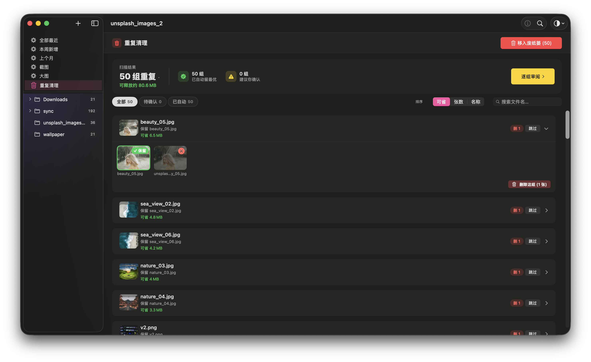
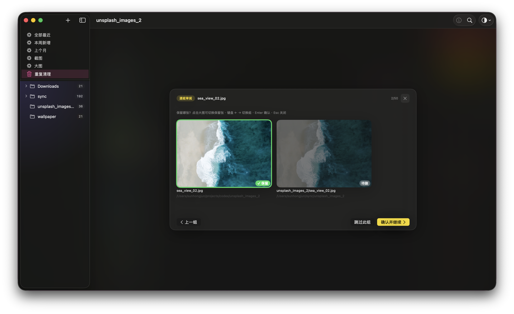
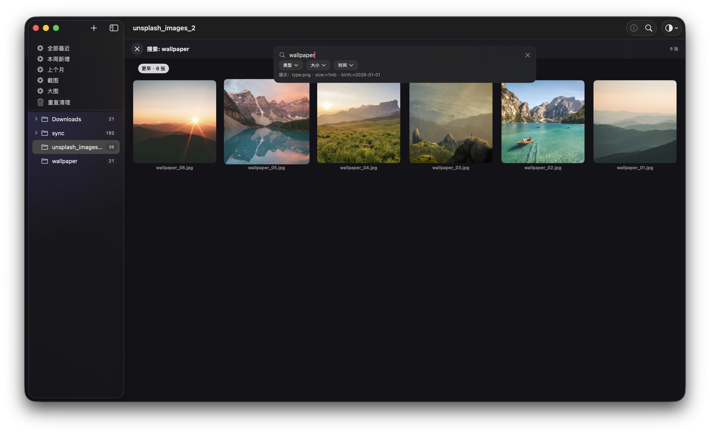

# Glance · 一眼

> 简洁、克制、专注内容的 macOS 本地看图 app —— **找重复省空间** + **沉浸式看图** + **零网络零遥测**

[](https://www.apple.com/macos/sonoma/) [](https://www.apple.com/mac/) [](#) [](https://github.com/sunhuaian2026/Glance/releases/latest)

**[⬇ 下载 v2.3.0](https://github.com/sunhuaian2026/Glance/releases/latest)** · 邮箱 `16414766@qq.com` · 小红书 `382336617`

### 缩略图网格


侧边栏树形文件夹 · 缩略图大小可调（80~280pt）· 6 种排序方式

### 内嵌预览（单击进入）


文件名跟随 toolbar · 方向键 ←→ 切换零延迟（±2 张预加载）· ESC 退回 grid

### QuickViewer 沉浸式（双击进入）


全窗口深色沉浸 · 自适应 fit / 1:1 切换 · 滚轮缩放 / 拖动平移 · 底部 filmstrip 导航

### EXIF Inspector（⌘I 切换）


文件名 / 尺寸 / 修改日期 / 大小 / 数据格式；含 EXIF 的图片额外显示相机型号 / 光圈 / 快门 / 焦距 / GPS

---

## v2.3 新功能（v1.0.0 → v2.3.0）

### 🗑️ 重复清理（新）



- **跨文件夹找完全相同的图**（SHA256 内容指纹），一键移废纸篓省硬盘空间
- **批量 + 单组双入口**：顶栏批量删全部待删，或行展开后底部「删除这组」/ 右键「立即删除此组」单组立删
- **撤销支持**：banner [撤销] 按钮整批还原（只要废纸篓还在）
- **bookmark 权限升级引导**：V1 用户首次清理时引导重选根目录（macOS 沙盒模型限定）



**「逐组审阅」浮层** — 所有 pending 组都可逐组眼审，← → 切组、Enter 确认、Esc 关闭

### 🔍 跨文件夹找相似图（新）
- 用 Vision feature print 找视觉相似（角度 / 滤镜 / 微调过的复制品）
- 选中图右键「找相似图」触发，临时结果视图浏览

### 🔎 全局搜索（新）



- **⌘F 全部受管文件夹搜文件名 / 路径**
- 类型 / 大小 / 时间 三组筛选 chips 多维过滤

### 📂 智能文件夹（5 个内置）
- 「全部最近」/「本周新增」/「上个月」/「截图」/「大图」直接跨文件夹看最新照片

### 🖼️ 看图增强
- **旋转** L / R / **翻转** H / V / **信息切换** ⌘I
- **复制**：复制图 ⌘C / 复制路径 ⌘⌥C / Finder 中显示 ⌘⇧R
- **删除到废纸篓**：Delete / ⌘⌫ + 撤销 toast（5s 内可还原）
- **右键 contextMenu 8 项** + bottomToolbar「更多 ⋯」镜像菜单
- **全屏完美填满**：图片宽高比匹配屏幕时全屏无黑边；否则维持留呼吸边

### 🪟 多种打开方式（新）
- Finder「打开方式」选 Glance — 看图窗独立不打扰主窗
- Dock 拖图标 + 关窗驻留（像 Photos）

### 📋 菜单栏完整化
- 文件 / 编辑 / 显示 / 图像 / 窗口 五大菜单 16 项快捷键统一

## 主要功能（v1.0 基础）

- **本地文件夹浏览** — 拖文件夹到侧边栏自动加入，构建子文件夹树 + 图片数 badge
- **沉浸式看图** — 双击进 QuickViewer 全窗口查看，缩放/拖拽/方向键零延迟切换
- **缩略图网格** — Toolbar 滑块调尺寸（80~280pt），6 种排序
- **EXIF Inspector** — 相机参数 / 拍摄时间 / GPS（⌘I 切换）
- **键盘快捷键** — Space / ESC / 方向键 / `F` 全屏
- **深浅外观自适应** — 跟随系统 / 强制深色 / 强制浅色，UserDefaults 持久化
- **中英双语** — 中文系统显示「一眼」，英文系统显示 "Glance"

## 系统要求

- macOS **14.0 (Sonoma)** 或更新
- Apple Silicon (M1 / M2 / M3 / M4) 或 Intel Mac (x86_64) — **universal binary**，同一个 DMG 自动适配

## 安装

下载 [latest release](https://github.com/sunhuaian2026/Glance/releases/latest) 的 DMG → 双击 → 拖 `Glance.app` 到 `Applications` → Launchpad / Spotlight 启动。

✅ 已通过 Apple 公证（Notarization），双击直接打开，不弹任何 Gatekeeper 警告。

## 数据安全 & 隐私

- App Sandbox 沙盒（用户主动授权才能读取文件夹）
- Apple Developer ID 签名 + 公证 + .app standalone staple + Hardened Runtime
- Security Scoped Bookmark 持久授权（重启 app 后自动恢复）
- **零网络请求 / 零数据上传 / 零遥测**
- **不永久删除**：「移到废纸篓」走 macOS 系统废纸篓不直接 unlink；单图删除 5s 撤销 toast + 批量去重 banner [撤销] 整批还原

## 开发

```bash
make build          # Debug 编译
make run            # build + 启动
make verify         # 三段式验证（静态规则 + xcodebuild + 单测）
make release        # 公开分发包（Release + Developer ID 签 + Hardened Runtime + create-dmg + 公证 + staple）
make release-dry    # 同上但跳过公证（本地干跑验证签名 + DMG 流程）
```

## 反馈与贡献

- 🐛 Bug / 功能建议 → [GitHub Issues](https://github.com/sunhuaian2026/Glance/issues)
- 📧 邮箱：16414766@qq.com
- 📕 小红书：**382336617**

## License

[MIT](LICENSE) © 2026 Hongjun Sun (孙红军)

---

Built with SwiftUI · 2026 © 孙红军
